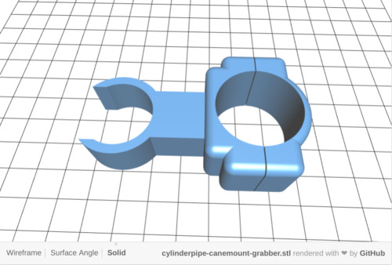
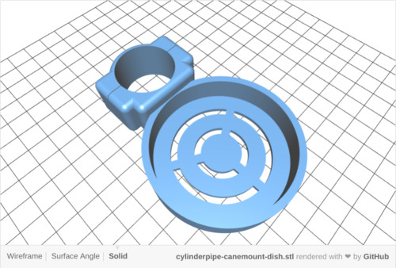
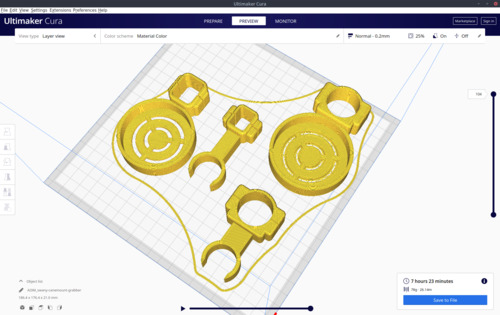
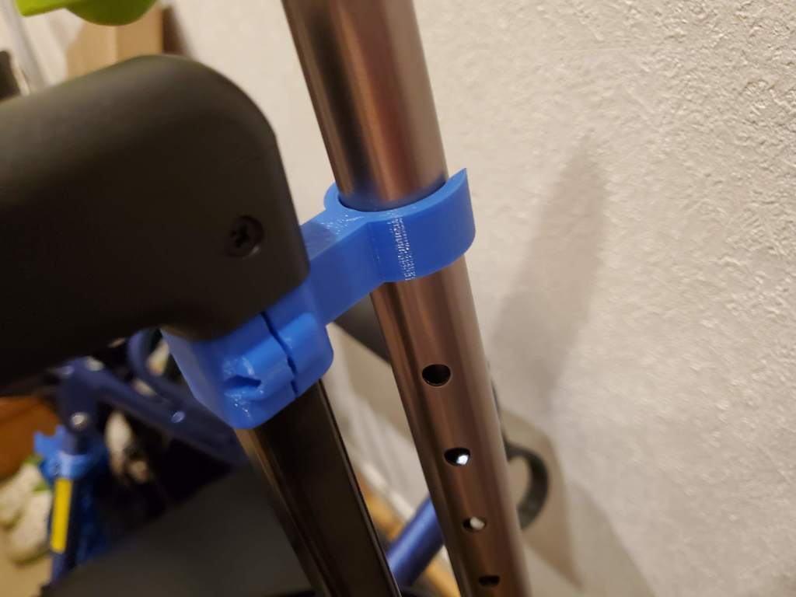
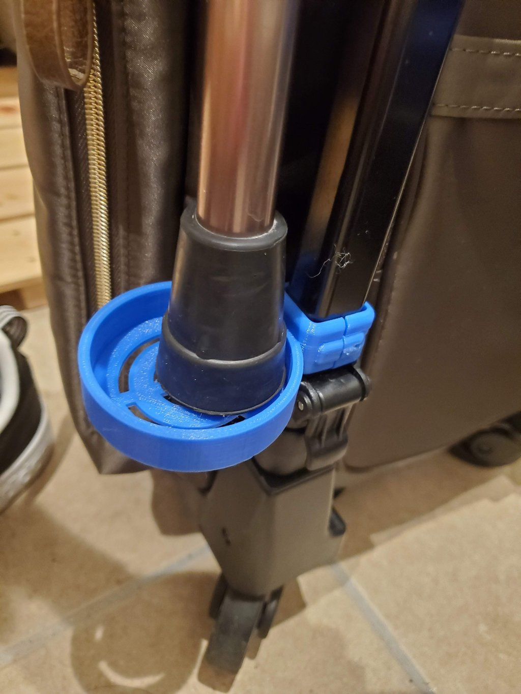

# Cane holder CAD

The open sourced cane holder CAD files for walkers and [SWANY bags](https://www.swany.co.jp/bag) sold in Japan.
These CAD files are 3D printable.

## How to customize

Adust parameters for each `scad/*.scad` .

## How to build stl files

1. Build docker image to retrive openscad binary `sudo docker build -t openscad .`
2. Run `make`
   - This Makefile calls `sudo` command to run docker container

## License

 - `*.scad` files are licensed under MIT license. (c) 2020 Kunihiko Miyoshi.
 - Generated `*.stl` files are licensed under [CC0 1.0](https://creativecommons.org/publicdomain/zero/1.0/deed.ja) .

## Printed examples

